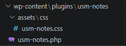
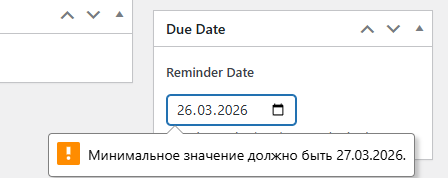
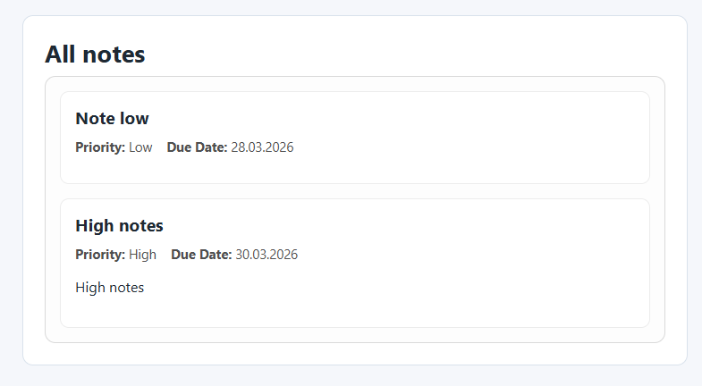
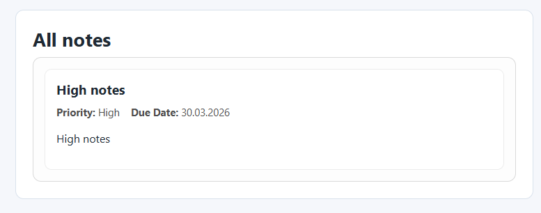

# Лабораторная работа: WordPress Plugin `USM Notes`

## 1. Общая информация

- **Дисциплина:** разработка CMS/WordPress
- **Тема лабораторной:** расширяемая модель данных WordPress
- **Автор:** студент Doicov Pavel

## 2. Цель работы

Целью лабораторной работы было освоить расширяемую модель данных WordPress и на практике реализовать:

- собственный тип записей (CPT),
- пользовательскую таксономию,
- метаданные с метабоксом и валидацией,
- вывод данных на фронтенде через шорткод,
- дополнительный виджет для отображения заметок.

## 3. Постановка задачи

Необходимо собрать учебный плагин **USM Notes**, который добавляет на сайт раздел «Заметки» с:

- приоритетами (`High / Medium / Low`),
- датой напоминания (`Due Date`),
- фильтрацией по приоритету и дате через шорткод.

## 4. Структура проекта

```text
wp-content/
  plugins/
    usm-notes/
      usm-notes.php
      assets/
        css/
          usm-notes.css
```



## 5. Инструкции по запуску

1. Открыть локальную установку WordPress.
2. Скопировать папку `usm-notes` в `wp-content/plugins/`.
3. В `wp-config.php` включить отладку:

```php
define('WP_DEBUG', true);
```

4. Перейти в админ-панель WordPress: `Плагины -> Установленные`.
5. Активировать плагин **USM Notes**.

Активированный плагин `USM Notes` в админ-панели.


## 6. Описание реализации

### Шаг 1-2. Базовый файл плагина

Создан основной файл `usm-notes.php` с заголовком плагина:

- `Plugin Name`,
- `Description`,
- `Version`,
- `Author`,
- `Text Domain`.

Добавлена защита от прямого доступа: `if ( ! defined( 'ABSPATH' ) ) exit;`.

```php
<?php
/**
 * Plugin Name: USM Notes
 * Description: Учебный плагин для лабораторной работы: CPT «Заметки», таксономия приоритетов, Due Date и вывод на фронтенде.
 * Version: 1.0.0
 * Author: Student USM
 * Text Domain: usm-notes
 */

if ( ! defined( 'ABSPATH' ) ) {
	exit;
}

if ( ! defined( 'USM_NOTES_DUE_DATE_META_KEY' ) ) {
	define( 'USM_NOTES_DUE_DATE_META_KEY', '_usm_notes_due_date' );
}

if ( ! defined( 'USM_NOTES_ERROR_TRANSIENT_KEY' ) ) {
	define( 'USM_NOTES_ERROR_TRANSIENT_KEY', 'usm_notes_due_date_error_' );
}
...
```

### Шаг 3. Регистрация CPT `usm_note`

Через `register_post_type()` реализован тип записей **Notes** со следующими параметрами:

- `public => true`,
- `supports => [title, editor, author, thumbnail]`,
- `has_archive => true`,
- `menu_icon => dashicons-welcome-write-blog`,
- подробные `labels` для UX в админке,
- `show_in_rest => true` для совместимости с редактором Gutenberg.

```php
/**
 * Регистрирует CPT "Заметки".
 */
function usm_notes_register_post_type() {
	$labels = array(
		'name'               => __( 'Notes', 'usm-notes' ),
		'singular_name'      => __( 'Note', 'usm-notes' ),
		'menu_name'          => __( 'Notes', 'usm-notes' ),
		'name_admin_bar'     => __( 'Note', 'usm-notes' ),
		'add_new'            => __( 'Add New', 'usm-notes' ),
		'add_new_item'       => __( 'Add New Note', 'usm-notes' ),
		'new_item'           => __( 'New Note', 'usm-notes' ),
		'edit_item'          => __( 'Edit Note', 'usm-notes' ),
		'view_item'          => __( 'View Note', 'usm-notes' ),
		'all_items'          => __( 'All Notes', 'usm-notes' ),
		'search_items'       => __( 'Search Notes', 'usm-notes' ),
		'not_found'          => __( 'No notes found.', 'usm-notes' ),
		'not_found_in_trash' => __( 'No notes found in Trash.', 'usm-notes' ),
	);

	$args = array(
		'labels'       => $labels,
		'public'       => true,
		'has_archive'  => true,
		'menu_icon'    => 'dashicons-welcome-write-blog',
		'show_in_rest' => true,
		'rewrite'      => array( 'slug' => 'notes' ),
		'supports'     => array( 'title', 'editor', 'author', 'thumbnail' ),
	);

	register_post_type( 'usm_note', $args );
}
add_action( 'init', 'usm_notes_register_post_type' );
```

### Шаг 4. Регистрация таксономии `usm_priority`

Через `register_taxonomy()` реализована таксономия **Priority**:

- `hierarchical => true` (как категории),
- `public => true`,
- `show_admin_column => true`,
- `show_in_rest => true`,
- связана с CPT `usm_note`.

Также автоматически создаются термины по умолчанию:

- `high` (High),
- `medium` (Medium),
- `low` (Low).

```php
**
 * Регистрирует таксономию приоритета.
 */
function usm_notes_register_taxonomy() {
	$labels = array(
		'name'              => __( 'Priorities', 'usm-notes' ),
		'singular_name'     => __( 'Priority', 'usm-notes' ),
		'search_items'      => __( 'Search Priorities', 'usm-notes' ),
		'all_items'         => __( 'All Priorities', 'usm-notes' ),
		'parent_item'       => __( 'Parent Priority', 'usm-notes' ),
		'parent_item_colon' => __( 'Parent Priority:', 'usm-notes' ),
		'edit_item'         => __( 'Edit Priority', 'usm-notes' ),
		'update_item'       => __( 'Update Priority', 'usm-notes' ),
		'add_new_item'      => __( 'Add New Priority', 'usm-notes' ),
		'new_item_name'     => __( 'New Priority Name', 'usm-notes' ),
		'menu_name'         => __( 'Priority', 'usm-notes' ),
	);

	$args = array(
		'hierarchical'      => true,
		'labels'            => $labels,
		'public'            => true,
		'show_admin_column' => true,
		'show_in_rest'      => true,
		'rewrite'           => array( 'slug' => 'priority' ),
	);

	register_taxonomy( 'usm_priority', array( 'usm_note' ), $args );
}
add_action( 'init', 'usm_notes_register_taxonomy' );
```


### Шаг 5. Метабокс даты напоминания (Due Date)

Реализовано:

- добавление метабокса через `add_meta_box()` в редакторе `usm_note`,
- поле `<input type="date">` для даты напоминания,
- `required` для обязательного заполнения,
- `min=today` для запрета прошлых дат на уровне UI,
- сохранение через `save_post_usm_note`,
- проверка `nonce` для защиты,
- серверная валидация:
  - дата обязательна,
  - формат только `YYYY-MM-DD`,
  - дата не может быть в прошлом,
- при невалидной дате запись принудительно переводится в `draft`,
- вывод ошибки в админке через `admin_notices`,
- отображение `Due Date` в списке записей CPT отдельной колонкой,
- сортировка по колонке Due Date.

```php
function usm_notes_add_due_date_meta_box() {
	add_meta_box(
		'usm_notes_due_date',
		__( 'Due Date', 'usm-notes' ),
		'usm_notes_due_date_meta_box_callback',
		'usm_note',
		'side',
		'default'
	);
}
add_action( 'add_meta_boxes', 'usm_notes_add_due_date_meta_box' );
```

Mетабокс `Due Date` в форме редактирования заметки.


Cообщение об ошибке при попытке сохранить пустую/прошедшую дату.



### Шаг 6. Шорткод `[usm_notes]`

Реализован шорткод:

```text
[usm_notes priority="X" before_date="YYYY-MM-DD"]
```

Поддержка параметров:

- `priority` - фильтр по slug таксономии (`high`, `medium`, `low`),
- `before_date` - фильтр по заметкам с `Due Date <= указанная дата`.

Логика:

- если параметры не указаны -> выводятся все заметки,
- если заметок нет -> сообщение: **"Нет заметок с заданными параметрами"**,
- если `before_date` указан в неверном формате -> сообщение об ошибке,
- для вывода подключается стиль `assets/css/usm-notes.css`.

#### Cтраница: Все notes
 `[usm_notes]`



#### Cтраница: High Usm Notes
 `[usm_notes priority="high"]`



#### Еще вариант 

`[usm_notes before_date="2025-04-30"]`.

### Дополнительно: виджет

Для соответствия цели лабораторной дополнительно реализован виджет **USM Notes Widget**:

- отображает ближайшие заметки,
- позволяет задать заголовок и количество элементов,
- выводит дату рядом с названием заметки.

Добавление и настройка виджета `USM Notes Widget`.

## 7. Краткая документация к плагину

### Основные сущности

- **CPT:** `usm_note`
- **Таксономия:** `usm_priority`
- **Метаполе даты:** `_usm_notes_due_date`

### Основные хуки

- `init` - регистрация CPT и таксономии,
- `add_meta_boxes` - добавление метабокса,
- `save_post_usm_note` - сохранение/валидация даты,
- `admin_notices` - вывод ошибок в админке,
- `wp_enqueue_scripts` - регистрация стилей,
- `widgets_init` - регистрация виджета.

### Шорткод

- `[usm_notes]` - все заметки.
- `[usm_notes priority="high"]` - только высокий приоритет.
- `[usm_notes before_date="2025-04-30"]` - заметки до заданной даты.
- `[usm_notes priority="medium" before_date="2025-12-01"]` - комбинированный фильтр.

## 8. Тестирование

Для теста были созданы 6 заметок с разными датами и приоритетами.

Проверено:

- корректное создание и редактирование заметок,
- назначение приоритетов,
- валидация обязательного Due Date,
- запрет прошлой даты,
- отображение Due Date в админ-таблице,
- вывод шорткода для всех/фильтрованных записей,
- корректная обработка пустой выборки.

**Скриншот-11:** пример набора из 5-6 тестовых заметок с разными приоритетами и датами.

## 9. Ответы на контрольные вопросы

### 1) Чем таксономия отличается от метаполя?

Таксономия нужна для **группировки и классификации** записей (например, приоритет, жанр, категория), а метаполе - для хранения **уникального атрибута конкретной записи** (например, дата напоминания, артикул, рейтинг).

- Когда выбирать таксономию: если значение повторяется у многих записей и по нему нужен удобный фильтр/архив.
- Когда выбирать метаданные: если значение индивидуально для каждой записи и чаще используется как дополнительное поле.

В моей работе:

- `Priority` - таксономия,
- `Due Date` - метаполе.

### 2) Зачем нужен nonce при сохранении метаполей?

`Nonce` защищает от CSRF-атак: подтверждает, что запрос на сохранение пришел из легитимной формы админки, а не с внешнего вредоносного сайта.

Если nonce не проверять, злоумышленник может подделать запрос от имени авторизованного пользователя и изменить данные записи без его явного согласия.

### 3) Какие аргументы `register_post_type()` и `register_taxonomy()` важны для фронтенда и UX?

Минимум три важных аргумента:

1. `public` - определяет, доступна ли сущность на фронтенде и в публичных запросах.
2. `has_archive` (для CPT) - создает архивную страницу, улучшает навигацию и UX.
3. `rewrite` - формирует человеко-понятные URL, важно для SEO и удобства пользователя.
4. `supports` (для CPT) - включает нужные поля редактора (title/editor/thumbnail), напрямую влияет на удобство контент-менеджера.
5. `labels` - понятные подписи в админке; без них UX заметно хуже.
6. `hierarchical` (для таксономии) - определяет древовидную структуру терминов (как категории).
7. `show_admin_column` (для таксономии) - делает колонку в таблице записей, ускоряет работу редактора.

## 10. Вывод

В рамках лабораторной я реализовал рабочий учебный плагин `USM Notes`, который демонстрирует ключевые механизмы расширения WordPress:

- CPT,
- пользовательскую таксономию,
- метаданные с валидацией и защитой,
- вывод данных через шорткод,
- дополнительный виджет.

Результат можно использовать как базу для более сложной системы задач/напоминаний.

**Ссылка на репозиторий:** *(добавить URL репозитория GitHub/GitLab после публикации)*

## 11. Список использованных источников

1. WordPress Developer Resources - Post Types: https://developer.wordpress.org/plugins/post-types/
2. WordPress Developer Resources - Taxonomies: https://developer.wordpress.org/plugins/taxonomies/
3. WordPress Developer Resources - Metadata: https://developer.wordpress.org/plugins/metadata/
4. WordPress Developer Resources - Shortcode API: https://developer.wordpress.org/plugins/shortcodes/
5. WordPress Developer Resources - Widget API: https://developer.wordpress.org/themes/functionality/widgets/
6. WordPress Developer Resources - Data Validation & Sanitization: https://developer.wordpress.org/apis/security/
